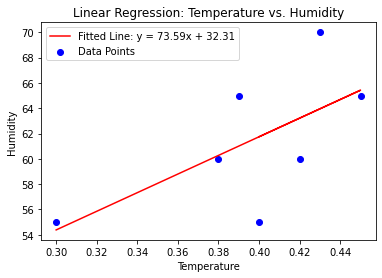

# Capstone
sample repo for capstone project

## Overview

Overview of repo

## Code

The code in this repo contains

### regression.ipynb

regression code for temperature and humidity

## Data

the data directory contains data required by the notebooks

### regression.csv

csv formatted temperature and humidity data used by regression.ipynb

## Graphics

The following graphics are useful here

